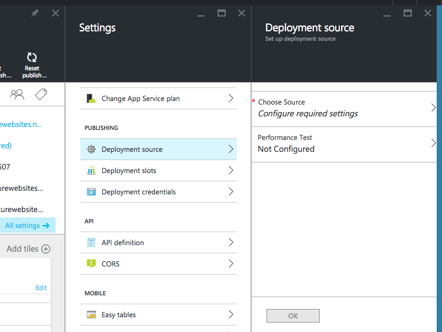
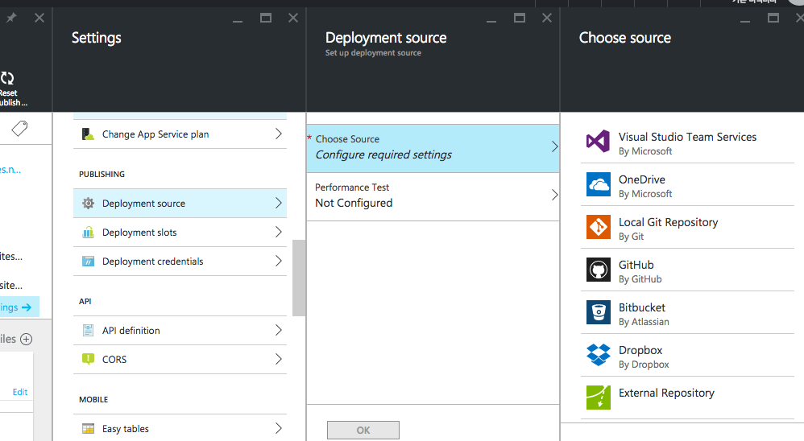
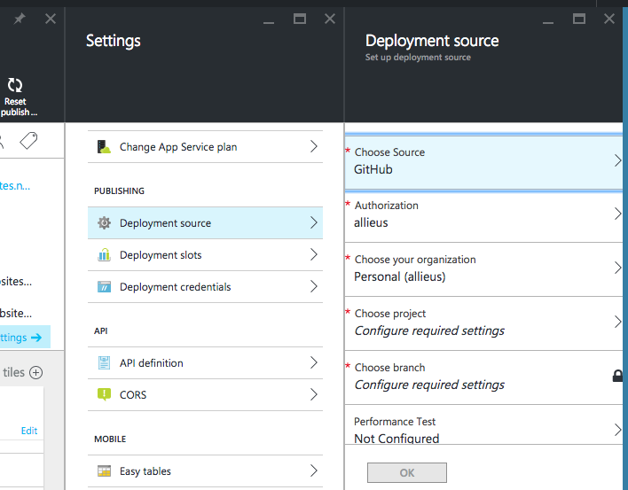
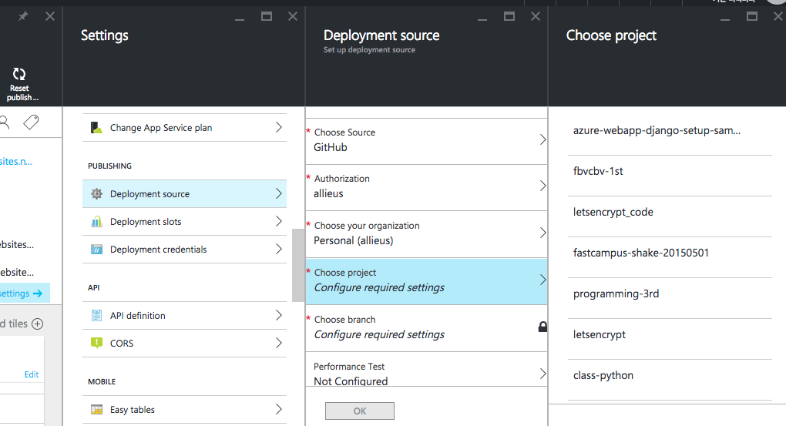
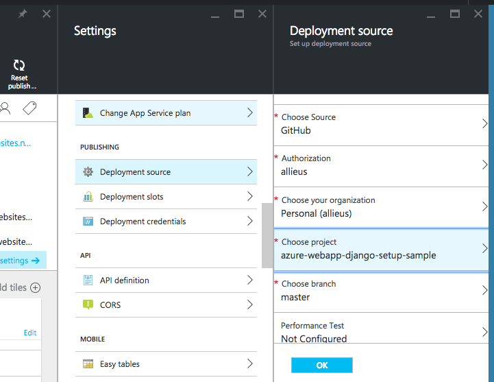
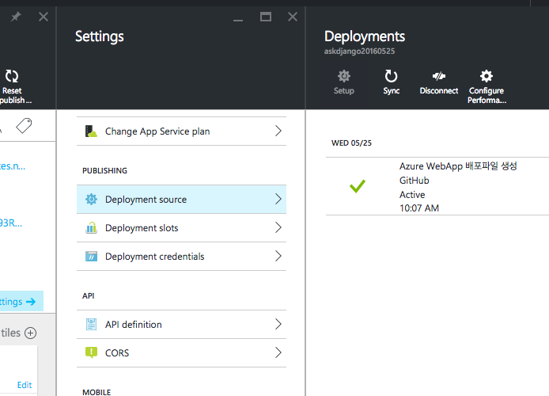

# azure-webapp-django-setup

명령 한 줄 만으로 Azure Webapp Django 배포에 필요한 파일들이 모두 생성이 됩니다.

Azure WebApp 에서는 파이썬 `2.7`과 `3.4`를 지원하지만, 본 스크립트에서는 `2.7`을 지원하지 않습니다. `deploy_settings.py` 에서 `PYTHON_VERSION` 을 `2.7`로 수정하셔도 동작하지 않습니다.

다음 파일들이 생성이 됩니다.

 * .deployment : 배포 스크립트 지정
 * deploy.py : 실질적인 배포작업을 수행하는 파이썬 스크립트
 * deploy\_settings.py : 배포 환경설정
 * web.3.4.config : 파이썬 3.4용 웹서비스 설정
 * ptvs\_virtualenv\_proxy.py : Python Tools for Visual Studio 용 가상환경 프록시

## 소스코드 선행작업

 1. 디렉토리 ROOT는 직접적으로 Django 프로젝트로 시작해야 합니다.
	 * 지원되는 구조
		 * manage.py
		 * myproject 디렉토리
	 * 하위 디렉토리에 django 프로젝트를 두고자할 경우, `web.3.4.config` 수정이 필요합니다.
 2. 프로젝트 ROOT 에 `requirements.txt` 파일이 꼭 필요하며, 현 Django 프로젝트 구동에 필요한 파이썬 팩키지들을 모두 명시해주세요. Azure WebApp 배포 시에 본 `requirements.txt` 에 명시한 파이썬 팩키지가 자동설치됩니다.
 3. `프로젝트/settings.py` 에 STATIC/MEDIA 설정을 꼭 넣어주세요. `web.3.4.config` 에서 아래 설정값으로 STATIC/MEDIA 파일 서빙을 하도록 설정되어있습니다.
	 * `STATIC_URL = '/static/'`
	 * `STATIC_ROOT = os.path.join(BASE_DIR, 'static')`
	 * `MEDIA_URL = '/media/'`
	 * `MEDIA_ROOT = os.path.join(BASE_DIR, 'media')`

생성된 프로젝트는 [azure-webapp-django-setup-sample](https://github.com/allieus/azure-webapp-django-setup-sample) 저장소를 참고하세요. [커밋내역](https://github.com/allieus/azure-webapp-django-setup-sample/commits/master) 을 통해 소스코드 수정내역을 살펴보세요.

## Azure WebApp 에 필요한 파일 생성

### 사용법 (Python 3를 쓰실 경우)

    python -c "from urllib.request import urlopen; print(urlopen('https://festi.kr/azure/setup.py').read().decode('utf8'))" | python - <django-settings-module>

명령 끝에 Azure WebApp 상에서 쓸 `DJANGO_SETTINGS_MODULE` 를 다음과 같이 지정해주세요. 다음은 사용 예입니다.

    python -c "from urllib.request import urlopen; print(urlopen('https://festi.kr/azure/setup.py').read().decode('utf8'))" | python - myproject.settings

### 사용법 (Python 2를 쓰실 경우)

    python -c "from urllib import urlopen; print(urlopen('https://festi.kr/azure/setup.py').read())" | python - <django-settings-module>

명령 끝에 Azure WebApp 상에서 쓸 `DJANGO_SETTINGS_MODULE` 를 다음과 같이 지정해주세요. 다음은 사용 예입니다.

    python -c "from urllib import urlopen; print(urlopen('https://festi.kr/azure/setup.py').read())" | python - myproject.settings

## Azure WebApp 에 배포하기

[배포 스크린캐스트](https://youtu.be/cOwA-gzZWHI) 를 확인해보세요. ;)

### Github 저장소 만들기

새로운 Github 저장소에 생성해서, 위 Django 프로젝트를 추가해주세요. Azure WebApp에서는 이 저장소로부터 소스코드를 끌어다가 배포를 수행합니다.

이미 생성해두신 Github 저장소가 있으시다면, 그것을 쓰셔도 무방합니다.

### Azure Portal 에서 새 Azure WebApp 생성
 
[Azure Portal](http://portal.azure.com) 에서 `새 Azure WebApp`을 생성해주세요.

좌측 사이드 메뉴에서 `New` 선택 - `Web + Mobile` 선택 - `Web App` 메뉴에서 다음 항목 입력하시고, 하단에 `Create` 버튼을 클릭해주세요. 그러면 Azure WebApp 이 생성이 됩니다. 최대 3분 정도 소요됩니다.

 * `App Name` : `원하시는 이름`을 입력해주세요. 유일한 이름이어야합니다. 여러분께서 주로 쓰시는 아이디를 써주시면 좋습니다.
 * `Subscription` : 디폴트로 둡니다.
 * `Resource Group` : 위 `App Name` 에 입력한 이름을 그대로 입력해주세요.
 * `App Service Plan/Location` : 디폴트로 둡니다.

좌측 사이드 메뉴에서 `App Services` 항목에서 생성한 `WebApp` 을 선택해주세요.

 * 해당 `WebApp`의 `Settings` 에서 `Deployment source` 를 선택해주세요.

 * 여러 배포옵션 중에 `Github` 를 선택하시고 인증을 수행하신 후에, 배포할 Django 프로젝트를 선택하시고, `OK` 버튼을 클릭해주세요.

 * 이제 `Azure WebApp` 에서 배포작업을 수행합니다. 최대 8분 정도 소요됩니다. 배포가 완료되면, 다음과 같은 화면을 확인하실 수 있어요.

### 배포가 끝나고 나서

#### 마이그레이션 수행하기

위 배포과정에서 마이그레이션 작업을 수행하지 않습니다.

현 Django 의 데이터베이스가 `sqlite`라면, Azure WebApp 상에서 마이그레이션 작업을 해줘야 합니다. 마이그레이션 작업을 위해서, Azure WebApp상의 `CMD` 창에 접근을 해야합니다. 다음 주소로 접근이 가능합니다.

	https://입력하신AppName.scm.azurewebsites.net/DebugConsole

`CMD` 창에서 `site\wwwroot` 경로로 이동해주세요.

	cd site\wwwroot

`env` 디렉토리에 생성된 가상환경을 활성화시켜주세요.

	env\Scripts\activate

마이그레이션을 수행해주세요.

	python manage.py migrate

Superuser 계정을 생성해주세요. `python manage.py createsuperuser` 명령은 본 `CMD`창에서는 지원되지 않습니다. 그래서 `파이썬 쉘` 을 통해 생성토록 하겠습니다.

장고 파이썬 쉘 진입

	python manage.py shell

superuser 계정 생성

	>>> from django.contrib.auth import get_user_model()
	>>> User = get_user_model()
	>>> User.objects.create_superuser('superuser_username', 'superuser_email', 'superuser_password')

이제, `http://입력하신AppName.scm.azurewebsites.net/admin/` 으로 접속해보세요.

## 참고

Azure WebApp 에 배포한 Django 프로젝트 샘플은 [이곳](http://askdjango20160525.azurewebsites.net/)에서 확인하실 수 있으며, 소스코드는 [github 저장소](https://github.com/allieus/azure-webapp-django-setup-sample)에서 확인하실 수 있습니다.

## 관련 문의

 * [ask@festi.kr](mailto:ask@festi.kr)
 * [AskDjango 페이스북 페이지](http://facebook.com/askdjango)
 * [AskDjango 페이스북 그룹](http://facebook.com/groups/askdjango)
 * [AskDjango 공식 사이트](http://festi.kr)
	 * [장고 차근차근 시작하기, 강의](http://festi.kr/class/django/)
